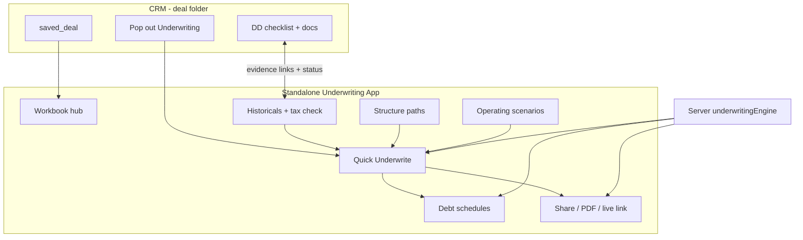

# Vettr Underwriting Tool — Milestone 2 Plan (SOIL-first rebuild)

## Product intent (from the operator)

You already underwrite in **B-SOIL.xlsx** day to day. Vettr should **not** invent a different mental model — it should:

1. **Speed up** the SOIL loop (less manual sheet fiddling when price, rates, growth, or seller terms change).
2. **Connect Due Diligence** so numbers are linked to tax returns / P&Ls / bank statements, validated, and trustworthy.
3. **Project** the business (baseline / optimistic / downside) without rebuilding projection tabs by hand.
4. **Structure** seller financing and capital stack variants side by side.
5. **Share** the model with investors, banks, and advisors (exec summary, bank package, waterfall, live link).
6. **Live as a standalone tool** (pop out of CRM) because sessions are long — CRM is the deal folder; underwriting is the workbook.

### Your real SOIL workbook (source of truth for UX)

`/Users/jamie/Downloads/SOIL/B-SOIL.xlsx` sheets we are matching:

| Sheet                                         | Role in day-to-day                                                                                                                                                                    | Vettr surface                          |
| --------------------------------------------- | ------------------------------------------------------------------------------------------------------------------------------------------------------------------------------------- | -------------------------------------- |
| **Quick Underwrite**                          | Daily driver — assumptions, deal costs, stack %, rates/terms, growth/margin, waterfall prefs, exit multiples, **10-year projection with SBA/seller debt columns**, investor waterfall | Primary full-page workbook             |
| **P&L YoY**                                   | Historicals with **TAX RETURN NUMBER** cross-check columns                                                                                                                            | Historicals + evidence validation      |
| **Profit & Loss**                             | Line-item detail + proforma adjustments                                                                                                                                               | Expert historical detail (M2c+)        |
| **Baseline / Optimistic Revenue Projections** | Multi-year operating scenarios                                                                                                                                                        | Operating scenarios on active path     |
| **FY2027 Monthly Breakout + Dashboard**       | Seasonality + **monthly DSCR** (SBA stress)                                                                                                                                           | Optional Y1 monthly module             |
| **Executive Summary**                         | Bank/advisor-facing deal terms + scenario compare                                                                                                                                     | Print/share output                     |
| **ROI-Investor / ROI-ACI**                    | Pref → ROC → profit-share waterfall, exit multiples                                                                                                                                   | Investor / sponsor returns tab + share |
| **Amortization**                              | Monthly SBA schedule (SOIL currently has amort bugs — Vettr must be *correct*)                                                                                                        | Engine-owned amort; UI table + export  |

Adjacent deal folder pattern (DD linkage target): Tax Returns, Financial Statements, Bank Statements, CapEx, Employees, Insurance, FFE, Corporate Info, Revenue by Client — same categories Vettr DD already uses.

### Real-world inspiration (patterns, not clones)

- **SBA 7(a) structuring practice** (80/10/10, equity injection, seller standby / IO / balloon, WC at close) — structure paths must make these first-class.
- **SMB acquisition underwriting models** (e.g. SDE add-back engines + DSCR + SBA financing sheets) — prove numbers with addbacks and coverage, not vanity IRR.
- **Spreadsheet-native FP&A tools** (Causal / Runway-class): one live model, scenario toggles, version history — not a form wizard pretending to be Excel.
- **Lender packages**: one-pager with sources & uses, historical EBITDA, projected DSCR, collateral/equity story.

---

## Honest status of Milestone 1 (do not treat as done)

M1 delivered a **scaffold**: schema, pure JS engine (~645 LOC), CRM-embedded panel, thin public share page. Plan todos were marked complete prematurely.

| Planned                           | Scaffold reality                    | Gap vs SOIL                                           |
| --------------------------------- | ----------------------------------- | ----------------------------------------------------- |
| Guided + expert workbook          | Step form; expert mode no-op        | Not Quick Underwrite                                  |
| Multi-year historicals + addbacks | Starting revenue/EBITDA fields only | Missing P&L YoY + tax check                           |
| Path comparison                   | Metric table + CSS bar              | No real structure workshop                            |
| Sensitivity / amort               | Partial in engine / approximate     | No monthly amort UI; SOIL-parity debt columns missing |
| DD bidirectional evidence         | One-way “DD” request                | No tax-return cross-check loop                        |
| XLSX import                       | CSV label heuristics                | Cannot ingest B-SOIL                                  |
| Standalone long-session UX        | **Missing**                         | Buried in CRM section                                 |
| Outputs                           | Browser print HTML                  | Not Exec Summary / bank pack quality                  |

**Keep:** `underwriting_`* tables, `underwritingEngine.js`, ACL routes, share-link tokens.  
**Rebuild:** product shell + Quick Underwrite UX depth. Treat prior UI as disposable.

---

## Architecture decisions (locked for M2)

1. **One workbook per deal** (unchanged). Blank canvas still creates manual deal + model.
2. **Standalone authenticated app** is the primary UX; CRM section becomes a thin launcher + summary tile.
3. **Quick Underwrite layout mirrors SOIL**, not a 5-step marketing wizard.
4. **Canonical math lives server-side**; client edits inputs, server recomputes (fix SOIL’s conflicting DSCR / broken amort).
5. **DD is the trust layer**: every material input can show evidence status; tax-return columns are first-class.
6. **Structure paths** = capital / seller-note / equity variants (not separate workbooks).
7. **Operating scenarios** = Base / Optimistic / Downturn (SOIL Baseline / Optimistic / Downside).
8. **Pop-out**: `window.open('/app/underwriting/:dealId')` with same auth session; full viewport, no CRM chrome.

---

## Milestone 2 slices (ship in order)

### M2a — Standalone shell + CRM pop-out (foundation)

**Routes**

- `/app/underwriting` — hub: list workbooks (deal name, baseline DSCR, updated, evidence %).
- `/app/underwriting/:dealId` — full workbook (primary).
- CRM deal workspace: summary strip + **Open underwriting** / **Pop out**.

**Shell chrome**

- Deal name, path selector, scenario toggle, Save revision, Share, Print.
- Left nav matching SOIL mental model: Quick Underwrite · Historials · Paths · Debt · Returns · Outputs.
- Dense, spreadsheet-adjacent UI (tables, sticky KPI header) — not another CRM card stack.

**Exit criteria:** User can pop out from a deal and work full-screen without CRM chrome; refresh restores workbook.

### M2b — Quick Underwrite parity (daily driver)

Recreate SOIL Quick Underwrite sections as one live page:

**Left / top — Assumptions**

- Purchase price; equity / SBA / seller % (and computed $); SBA rate & term; seller rate, term, **note mode** (amort / IO / standby / balloon); standby years / balloon year.
- Starting revenue (TTM), growth rate, EBITDA margin, owner salary, EBITDA (or derived).
- Pref rate, investor / sponsor profit share; exit multiples (scenario 1 & 2).

**Deal costs**

- QoE, legal, closing, DD, working capital → total uses; cash at close to seller.

**Calculated strip (always visible)**

- SBA annual payment, seller annual payment, total debt service, FCF, Y1 DSCR (lendable ≥ 1.25x callout).

**10-year projection table (core)**
Columns aligned to SOIL: Year · Revenue · Owner Salary · EBITDA · SBA Pmt · DSCR · SBA Int · SBA Prin · SBA Bal · Seller Pmt · Seller Int · Seller Prin · Seller Bal · FCF.

**Inline waterfall preview**

- Pref → capital return → profit share (investor + sponsor), with exit columns for multiple #1 / #2.

**Exit criteria:** Changing purchase price / seller mode / growth updates the full 10-year table and KPIs without leaving the page. Numbers reconcile to engine unit tests (including standby seller DSCR exclusion).

### M2c — Historials + DD trust loop

**Historicals grid (P&L YoY spirit)**

- Years as columns (e.g. 2023–2025+).
- Revenue, COGS, opex, addbacks → SDE / adjusted EBITDA.
- **Tax return number** column per year (manual entry now; OCR later) with variance vs books and pass/fail.

**Evidence**

- Each key input: `source`, `verified`, linked DD item / document.
- From underwriting: Request document → creates/links DD item (tax return, P&L, bank stmt).
- From DD: “Used in underwriting” badge; complete/receive → underwriting flips to **evidence received — review**.
- Coverage meter on workbook header: “6/9 key inputs evidence-backed”.

**Exit criteria:** A tax-return DD item linked to 2024 revenue shows status inline on the historicals grid; user can confirm/verify the number.

### M2d — Structure paths (seller financing workshop)

- Duplicate baseline path → rename (“Standby 2yr”, “IO + balloon Y5”, “15% equity”).
- Path-specific: price override, stack mix, rates/terms, seller mode, pref/split, hold/exit.
- Comparison matrix (SOIL Exec-style): equity check, cash at close, Y1 DSCR/CoC/FCF, investor/sponsor IRR & MOIC, exit equity.
- Charts: DSCR over time by path; IRR/MOIC bars.
- Mark preferred path for LOI / bank package.

**Exit criteria:** Two seller-note structures compared in one view with scenario toggle (Base/Optimistic/Downturn).

### M2e — Scenarios + correct amortization (+ optional monthly)

- Operating scenario toggle reshapes growth/margin curves (SOIL Baseline / Optimistic / Downside).
- **Correct** monthly SBA + seller amort schedules (fix SOIL’s 24-pay/year / negative balance issues); annual rollup feeds Quick Underwrite.
- Optional Y1 monthly DSCR dashboard (seasonality weights) — ship after annual path is solid.

**Exit criteria:** Amort schedule balances to $0 at term; Y1 DSCR matches annual table; scenario switch updates Exec-style compare.

### M2f — Share & outputs

- **Executive Summary** print view (deal terms + historicals + scenario compare + key insights notes).
- **Bank one-pager** (baseline path): sources & uses, historical EBITDA, projected DSCR, equity injection.
- **Investor pack**: waterfall + exit multiples (ROI-Investor / ROI-ACI spirit).
- **Path comparison** printable.
- **Private live links** (existing tokens): read-only live workbook summary; optional password/expiry; pin revision / preferred path.

**Exit criteria:** Copy live link; open in incognito; bank one-pager prints cleanly.

### M2g — B-SOIL import (after UX exists)

- Upload XLSX via SheetJS (`xlsx` already in backend).
- Detect Quick Underwrite / P&L YoY / Assumptions labels; propose mappings with confidence.
- Guided review; unmapped tabs → custom sheets.
- Provenance `workbook_import` + labeled revision “Imported from B-SOIL.xlsx”.

**Exit criteria:** Importing B-SOIL fills Quick Underwrite enough to recompute DSCR within a defined tolerance of SOIL’s intent (document known SOIL formula bugs we intentionally do *not* copy).

---

## Explicitly out of scope for M2 (still designed)

- Phase 4: PDF/tax OCR auto-extraction into historicals.
- Phase 5: document-over-time diffs (“new 2025 return changed EBITDA by X”); investor deck generator; reusable custom sheet templates.
- Freeform Excel formula engine.
- Monte Carlo / full tax PPA.

---

## Engineering notes

- **UI structure:** replace monolithic `UnderwritingPanel.jsx` with standalone page modules under `web/src/pages/underwriting/` + shared components; CRM panel becomes launcher/summary only.
- **Engine:** extend (don’t rewrite) — proper monthly amort, historical year grid inputs, dual exit multiples, seasonality module.
- **Tests:** expand `backend/scripts/test-underwriting-engine.mjs` (or Jest) for amort balance-to-zero, standby DSCR, waterfall cumulative pref, sources & uses balance; add a golden-file fixture derived from B-SOIL *inputs* (not SOIL’s buggy amort outputs).
- **Versioning:** bump 4.1.x per shipped slice; interactive testing checklist after each slice; commit only after user confirms.
- **Logging:** keep `[underwriting]` console/server logs on load/save/compute/share/import.

---

## Success metric

You can open Optimal Technology (or any deal), pop out underwriting, adjust seller note from amortizing → 2-year standby in under 30 seconds, see DSCR/FCF/IRR update across a 10-year table, see which figures are still unverified against tax returns, and send a bank/investor link — **without opening Excel**.

---

## Process

1. Approve this M2 plan (especially M2a→M2b order and SOIL field parity list).
2. Implement M2a (standalone + pop-out).
3. Interactive testing checklist → your confirmation.
4. M2b Quick Underwrite depth → repeat.
5. Continue M2c→M2g in order unless you reprioritize share/import earlier.

